# The master-plan pack — one ticket, end to end

Three plugins — [`create-master-plan`](../../plugins/create-master-plan/), [`decompose-plan`](../../plugins/decompose-plan/), [`plan-review`](../../plugins/plan-review/) — are one workflow. Each plugin's README documents that plugin. **This document is the worked example that joins them**: a single ticket, on a single repository, from an empty machine to a merged change.

Everything here is one continuous story. The repository, the ticket and the artifacts are invented; every command, file name, template section and agent name is real, and comes from the skills as they ship.

---

## The example project

A payments platform in one repository, deliberately polyglot — because the interesting failures in a multi-agent run happen *between* layers, not inside one.

```
acme-payments/
├── payments-api/                  Java 21 · Spring Boot 3 · Gradle module :payments-api
│   ├── src/main/java/com/acme/payments/…
│   ├── src/main/resources/application.yml
│   └── src/test/java/com/acme/payments/…      JUnit 5 · AssertJ · Mockito · Testcontainers
├── reconciler/                    Python 3.12 worker · pyproject.toml · pytest
│   └── src/reconciler/…
├── db/migrations/                 Flyway SQL · PostgreSQL 16
├── deploy/
│   ├── docker/                    Dockerfile.api · Dockerfile.reconciler
│   └── helm/payments/             Helm chart · values.yaml · templates/
├── docs/                          architecture notes, runbooks, ADRs
└── .claude/rules/                 the team's coding rules
```

**The ticket.** GitHub issue **#412 — "Support partial refunds"**. Today only full refunds exist. Finance needs to refund part of a payment, more than once, up to the original amount. It crosses every layer: a schema change, Java domain and API work, a Python reconciler that must stop treating a refund as terminal, Helm configuration for a new feature flag, and an end-to-end proof.

That is the shape this workflow is for. A one-file change does not need it.

---

## The five steps, and what carries state between them

Nothing is handed between steps by hand. **The plan folder is the handoff** — every step reads and writes `docs/plans/GH-412/`, so "give the next step the plan" is just naming that folder again.

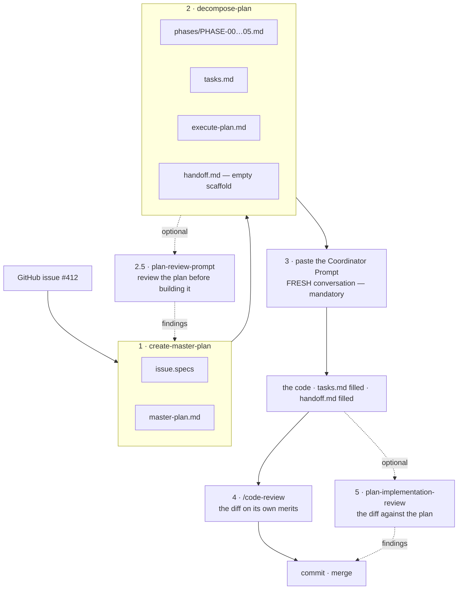

| # | You run | Conversation | Produces |
|---|---|---|---|
| 1 | `/create-master-plan 412` | any | `issue.specs`, `master-plan.md` |
| 2 | `/decompose-plan docs/plans/GH-412` | the same one is fine | `phases/`, `tasks.md`, `execute-plan.md`, `handoff.md` |
| 2.5 | `/plan-review-prompt` | any | findings you fold back into the plan — **optional** |
| 3 | paste the Coordinator Prompt | **a fresh one — mandatory** | the code |
| 4 | `/code-review` | any | findings on the diff |
| 5 | `/plan-implementation-review` | any | findings on the diff *against the plan* — **optional** |

Only one transition is load-bearing: **step 3 must start in an empty conversation.** The coordinator ends up holding the master plan, every phase file and every teammate's report at once. Start it in a window that already contains your planning discussion and it hits compaction mid-run — and a coordinator that has forgotten round 1's deviations will cheerfully dispatch round 2 on top of them.

---

# Part 0 · Setup

Once per machine, except the last step.

### 0.1 · The marketplace and the three plugins

```
/plugin marketplace add necofx/necofx-claude-marketplace
/plugin install create-master-plan@necofx
/plugin install decompose-plan@necofx
/plugin install plan-review@necofx
```

If the first line fails to clone, the `owner/repo` shorthand is trying SSH. Pass the HTTPS URL instead — `https://github.com/necofx/necofx-claude-marketplace.git` — or export `CLAUDE_CODE_PLUGIN_PREFER_HTTPS=1`.

### 0.2 · `superpowers` — required, not optional

```
/plugin marketplace add anthropics/claude-plugins-official
/plugin install superpowers@claude-plugins-official
```

Steps 1 and 2 degrade gracefully without it. **Step 3 does not.** The phase files instruct each teammate to invoke `superpowers:verification-before-completion`, and that is the gate standing between "the agent says the phase is done" and "the phase is done". In a run where nobody watches any individual phase, it is most of what green is worth.

### 0.3 · The specialist agents

Every phase file carries an **Owner Agent** line, which the coordinator passes straight to `Agent(subagent_type=…)`. An unresolvable name silently falls back to `general-purpose` — the run survives, it just loses the specialist's system prompt. So install the bundles that ship the names your phases will cite.

```
/plugin marketplace add wshobson/agents
```

For this project's stack:

```
/plugin install jvm-languages@claude-code-workflows
/plugin install python-development@claude-code-workflows
/plugin install kubernetes-operations@claude-code-workflows
/plugin install cicd-automation@claude-code-workflows
/plugin install database-design@claude-code-workflows
/plugin install comprehensive-review@claude-code-workflows
```

| Bundle | Buys you | Phases that will name it |
|---|---|---|
| `jvm-languages` | `java-pro` | everything under `payments-api/src/main/java` |
| `python-development` | `python-pro` | the reconciler |
| `kubernetes-operations` | `kubernetes-architect` | `deploy/helm/**` |
| `cicd-automation` | `deployment-engineer` | `deploy/docker/**` — **there is no Docker agent**; this is it |
| `database-design` | `sql-pro`, `database-architect` | the Flyway migration |
| `comprehensive-review` | `code-reviewer`, `security-auditor`, `architect-review` | the closing review of almost every plan |

Two traps worth knowing before you install too much: agents are duplicated across bundles, so install the smallest bundle carrying the name and stop; and `developer-essentials` ships exactly one agent despite the name.

### 0.4 · CodeGraph — optional, and it earns its keep here

```sh
npm install -g @colbymchenry/codegraph    # a real global install; npx-only silently fails
codegraph install -y -t claude -l global  # the agent id is `claude`, not `claude-code`
codegraph telemetry off                   # telemetry ships ENABLED
cd ~/src/acme-payments && codegraph init
```

Used at four separate points in this workflow, and each one is a place the workflow otherwise guesses:

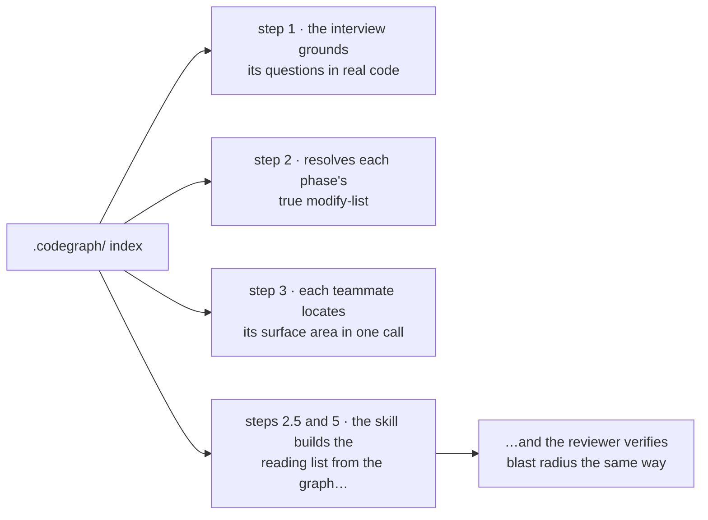

The one that pays for the install is **step 2**: `codegraph impact` finds the registration file the plan forgot to mention, and a forgotten registration file is the usual cause of two phases in the same round colliding.

Every CodeGraph instruction in every skill is conditional on `.codegraph/` existing, so an unindexed repo simply costs more tokens. **No skill will ever index for you** — it writes hundreds of megabytes, so it stays your decision.

### 0.5 · Restart

Skills load at session start. Open a new conversation before the first `/create-master-plan`.

---

# Part 1 · From ticket to plan

```
/create-master-plan 412
```

Takes `412`, `#412`, or the issue URL. GitHub is the default and uses the `gh` CLI, so `gh auth status` should be happy. Jira and Linear are adapter profiles; pasted free-form text also works, in which case step 1 is the only step that ever knew there was a tracker.

### What it does before it asks you anything

1. Creates `docs/plans/GH-412/`. If that folder already exists with files, it stops and asks — overwrite, merge to `.bak.<timestamp>`, or abort. It will not clobber silently.
2. Fetches the issue with every field and comment, downloads attachments into `attachments/`, follows up to 5 linked items and quotes up to 3 cited documents in full. **A referenced merged PR is the most valuable thing it can find** — its file list is how "this ticket is gap-closure, not a build" gets discovered without grepping blind.
3. Globs `docs/**/*.md` with no exclusions and no cap, grepping for the ticket key, the component names and the distinctive nouns. Long output here is correct: this is the step that surfaces the internal document nobody remembered.
4. Writes `issue.specs`. **Before** the interview, deliberately — everything in that file now counts as known, so an interview question the file already answers is a defect you can point at.

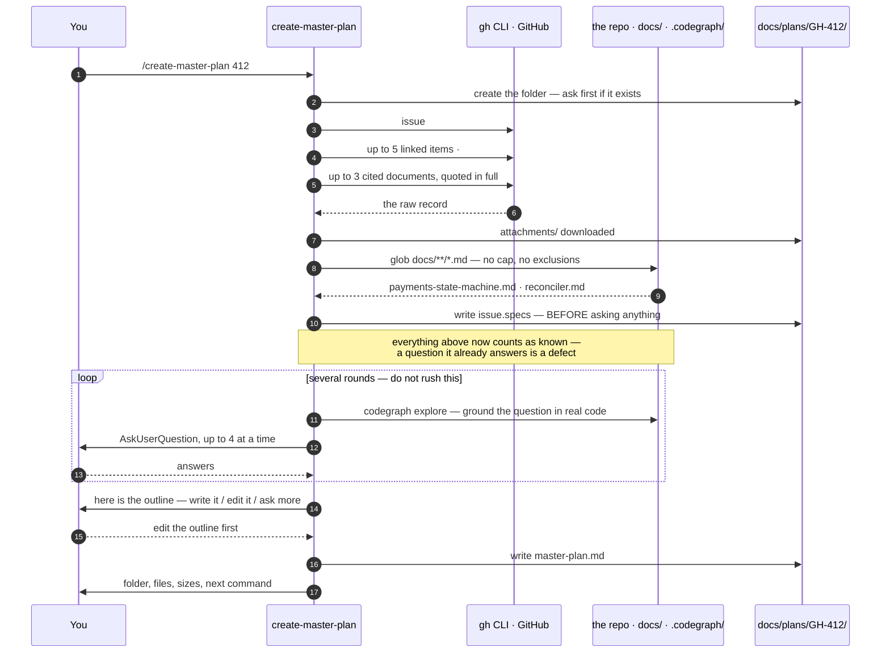

### `issue.specs` — the dossier

```markdown
# GH-412 — Support partial refunds

**Status:** open
**Type:** feature
**Priority:** _(not supplied by this source)_
**Author:** finance-ops
**Assignee:** sebas
**Components:** _(not supplied by this source)_
**Labels:** payments, api, needs-migration
**Source:** github
**Fetched at:** 2026-08-14 09:12
**Plan folder:** `docs/plans/GH-412/`

## 1. Description

Today `POST /payments/{id}/refund` refunds the full captured amount and marks the
payment REFUNDED. Finance needs partial refunds: several refunds against one
payment, each with its own amount, until the sum reaches the captured total.

## 2. Acceptance Criteria

- A payment can be refunded partially, more than once
- The sum of refunds can never exceed the captured amount
- The reconciler no longer treats the first refund as terminal
- Existing full-refund clients keep working unchanged

## 4. Linked issues

### #388 · relates-to · merged
**Title:** Add idempotency keys to payment mutations
Introduced `IdempotencyKeyFilter` and the `idempotency_keys` table. Touched
`PaymentController.java`, `IdempotencyKeyFilter.java`, `V9__idempotency.sql`.
Any new mutating endpoint inherits this filter — GH-412's refund endpoint must
carry an idempotency key.

## 7. Related local docs

- `docs/architecture/payments-state-machine.md` — matched: `REFUNDED`, `payment` —
  excerpt: "CAPTURED → REFUNDED is terminal; the reconciler asserts it"
- `docs/runbooks/reconciler.md` — matched: `reconciler` —
  excerpt: "the worker re-reads events from the last checkpoint on restart"

## 8. Context Gaps

- GitHub supplies no priority or components field; the interview should confirm
  urgency and which teams own the reconciler.
- The ticket never says whether a partial refund can be reversed. Ask.
```

That last section is the one people skim past and shouldn't. **An absence is data.** Recording *why* something is empty stops a later reader from mistaking thinness for laziness.

### Then the interview — and this is the part that decides quality

Questions arrive through `AskUserQuestion` with real options, batched up to four at a time, over a coverage matrix: goal and value, constraints, scope boundary, technical implementation, edge cases, tradeoffs, acceptance criteria, testing strategy, validation gates. Anything `issue.specs` already answered is skipped, and each question is grounded in the code first — on an indexed repo, with a single `codegraph explore` call rather than a read-every-match loop.

For GH-412 it will ask things like: can a partial refund be reversed? What happens to the payment state when refunds sum to exactly the captured amount? Is the reconciler allowed to lag, or must it be strictly consistent? Which of these gates does CI actually run?

**Answer properly.** Everything downstream derives from this. A vague requirement here becomes several agents confidently building the wrong thing *in parallel*, two steps later. Expect several rounds — two rounds only covers the obvious.

Before writing, it shows you the outline and offers: *looks good — write it* / *edit the outline first* / *ask more questions*. Use the middle one freely; it is far cheaper than fixing the plan afterwards.

### `master-plan.md` — the excerpt that matters

```markdown
# GH-412 — Master Plan: Support partial refunds

## Tech Stack

- **Java / JVM (Gradle)** — covers the API and domain
  - Java 21, Spring Boot 3.3
  - Build: `./gradlew :payments-api:build`
  - Test: JUnit 5 + AssertJ + Mockito; Testcontainers for the Postgres integration tests
  - Coding rules: `.editorconfig`, `config/checkstyle/checkstyle.xml`, `.claude/rules/*.md`
- **Python** — covers the reconciler worker
  - Python 3.12, pytest
  - Build/test: `uv run pytest reconciler/tests`
  - Coding rules: `pyproject.toml` [tool.ruff], `.claude/rules/python.md`
- **PostgreSQL 16** — Flyway migrations under `db/migrations/`
- **Docker / Kubernetes** — Helm chart at `deploy/helm/payments`

## Out of scope

- Reversing a partial refund — confirmed out of scope in the interview; it needs
  a policy decision finance has not made.
- Multi-currency refunds — the platform is single-currency until GH-455.

## Technical Requirements

### Data layer
- A `refunds` table exists with `payment_id`, `amount_minor`, `created_at`,
  `idempotency_key`, and a constraint that the sum per payment cannot exceed
  the payment's captured amount.

### Service layer
- `RefundService` supports repeated partial refunds and rejects any refund that
  would breach the captured total, returning a domain error rather than throwing.

### API layer
- `POST /payments/{id}/refunds` accepts an amount, carries an idempotency key
  per GH-388, and returns 409 on over-refund.

### Worker
- The reconciler treats `refund.partial` as non-terminal and only closes a
  payment when the refunded sum equals the captured amount.

### Cross-cutting
- The feature is behind `payments.partial-refunds.enabled`, defaulted off, and
  settable per environment from the Helm values.

## Validation & Testing

- [ ] `./gradlew :payments-api:build` → 0 warnings, 0 errors
- [ ] `./gradlew spotlessCheck check` → clean
- [ ] `uv run pytest reconciler/tests` → green
- [ ] `helm template deploy/helm/payments` → renders, and the new key is present
- [ ] Flyway migration applies to a clean database and to a copy of staging
```

### Before you move on, check exactly two things

**Is the implementation outline at chunk level?** It should say "add the refunds endpoint", not name functions. Pre-decomposing here produces phases that collide later.

**Do the validation gates name your real commands?** If the plan says `pytest` and your project needs `uv run pytest`, fix it now. An assumed verification command does not fail at planning time — it fails in round 2, when four phases already rest on it and correcting it means redoing the decomposition.

---

# Part 2 · From plan to phases and rounds

```
/decompose-plan docs/plans/GH-412
```

It reads the plan end to end, lists every deliverable, builds the dependency graph, and groups the work into phases. A **good phase** is single-focus — an "and" in the goal means split it — independently verifiable, 30 minutes to 3 hours, and names every cross-phase dependency instead of implying it.

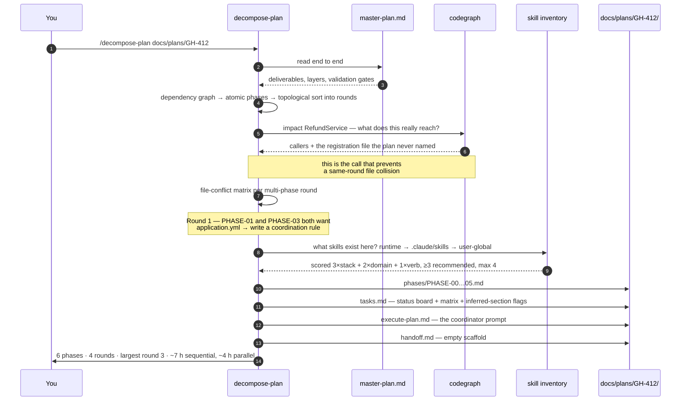

Then it topologically sorts them into rounds. **Phases in a round run in parallel; rounds run sequentially.**

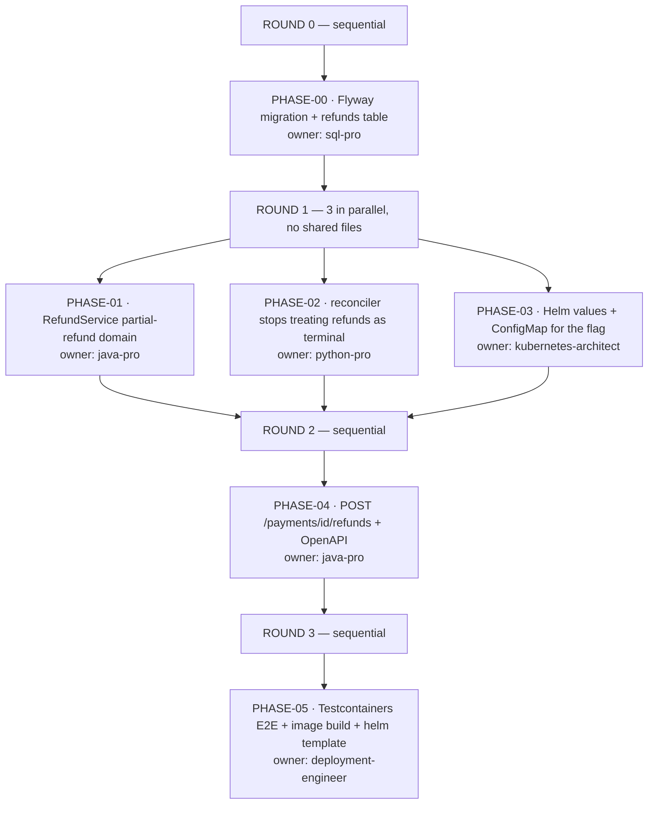

Two mechanisms do the real work here, and both are worth understanding because both are things you will be asked to check.

**The file-conflict matrix.** For every multi-phase round it lists each phase's create/modify files and verifies no two overlap. In this plan it catches a real one: Phase 01 needs the feature-flag property in `payments-api/src/main/resources/application.yml`, and Phase 03 wants to template the same key from Helm. Same round, same file. An unavoidable overlap does not stop the run — it gets an explicit coordination rule written into `tasks.md` naming who edits first.

**Skill matching.** Each phase's "Skills to Invoke" is filled from an inventory of what actually exists on your machine — runtime-active, then `.claude/skills/**/SKILL.md`, then user-global — scoring candidates `3×stack + 2×domain + 1×verb`, `+2` when runtime-active, `−5` on a conflicting stack, recommended at ≥3 and capped at 4. No match means the always-on skills plus an explicit note, never a padded list.

### `tasks.md` — the shared status board

Every teammate edits this file, and only its own row.

```markdown
# GH-412 Partial Refunds — Task Tracker

**Decomposition strategy:** by architectural layer, schema first
**Total phases:** 6 across 4 rounds
**Team name:** `gh-412-partial-refunds`

## Phase status

| # | Phase | Round | Owner agent | Status | Agent | Started | Finished | Commits | PR |
|---|---|---|---|---|---|---|---|---|---|
| 00 | Flyway migration + refunds table | 0 | sql-pro | pending | — | — | — | — | — |
| 01 | RefundService partial-refund domain | 1 | java-pro | pending | — | — | — | — | — |
| 02 | Reconciler: refunds are non-terminal | 1 | python-pro | pending | — | — | — | — | — |
| 03 | Helm values + ConfigMap for the flag | 1 | kubernetes-architect | pending | — | — | — | — | — |
| 04 | POST /payments/{id}/refunds | 2 | java-pro | pending | — | — | — | — | — |
| 05 | E2E: Testcontainers + image + helm template | 3 | deployment-engineer | pending | — | — | — | — | — |

**Status legend:** `pending` · `in_progress` · `blocked` · `completed` · `dropped`

## File-conflict matrix (parallel rounds)

Round 1 file-conflict check — confirm before dispatch:

| File | Phase 01 | Phase 02 | Phase 03 |
|---|---|---|---|
| `payments-api/src/main/java/com/acme/payments/refund/RefundService.java` | Modify | — | — |
| `payments-api/src/main/resources/application.yml` | Modify | — | Modify |
| `reconciler/src/reconciler/handlers.py` | — | Modify | — |
| `deploy/helm/payments/values.yaml` | — | — | Modify |
| `deploy/helm/payments/templates/configmap.yaml` | — | — | Modify |

**Coordination rule — `application.yml`.** Phase 01 owns this file and adds
`payments.partial-refunds.enabled: false`. Phase 03 must NOT edit it; it templates
the key into the ConfigMap and documents the property name in its notes. If Phase 03
finds the property missing, it reports a blocker rather than adding it.

## Coordination Notes

- **Inferred:** the master plan does not say whether the reconciler's checkpoint
  survives the schema change. Phase 02 assumes it does and verifies with a restart
  test. Flagged here because it was inferred, not specified.
```

That last block is the one to read before you dispatch anything. **The `## Coordination Notes` section flags what the skill had to infer because the master plan did not say.** Every flag there is a place a wrong assumption can propagate into three parallel agents.

### A phase file, in full shape

`phases/PHASE-01-refund-service-domain.md`, abbreviated at the repetitive parts:

```markdown
# GH-412 / Phase 01 — RefundService partial-refund domain

> **For agentic workers:** REQUIRED SUB-SKILL: invoke
> `superpowers:subagent-driven-development` before touching code.

**Goal:** RefundService accepts repeated partial refunds and rejects any that would
breach the captured total.

**Architecture:** Implements § Service layer of the master plan. Sits between the
existing `PaymentRepository` and the not-yet-existing REST endpoint of Phase 04.

**Tech Stack:** Java 21, Gradle. Build `./gradlew :payments-api:build`.
Test `./gradlew :payments-api:test --tests "com.acme.payments.refund.*"`.
JUnit 5 + AssertJ + Mockito. Rules: `.editorconfig`,
`config/checkstyle/checkstyle.xml`, `.claude/rules/java.md`.

## Files

- **Create:** `payments-api/src/main/java/com/acme/payments/refund/PartialRefundPolicy.java`
- **Create:** `payments-api/src/test/java/com/acme/payments/refund/RefundServiceTest.java`
- **Modify:** `payments-api/src/main/java/com/acme/payments/refund/RefundService.java` — accept an amount, drop the terminal-state assumption
- **Modify:** `payments-api/src/main/resources/application.yml` — add the feature flag, default false

## Dependencies

- Phase 00: Flyway migration + refunds table

## Owner Agent

`java-pro`

## Risk / Effort

Risk: Medium — touches the payment state machine. Effort: ~2 h.

## Skills to Invoke (teammate-side)

1. `Skill(skill="superpowers:using-superpowers")` — establish skill discipline
2. `Skill(skill="superpowers:subagent-driven-development")` — execution discipline
3. `Skill(skill="superpowers:test-driven-development")` — red-green-refactor
4. `Skill(skill="superpowers:verification-before-completion")` — the done gate
5. `Skill(skill="database-design:postgresql")` — *the sum constraint is enforced in the schema too*

## Documents to Read

- `docs/architecture/payments-state-machine.md` — the CAPTURED → REFUNDED transition this phase makes non-terminal
- `docs/plans/GH-412/issue.specs` § 4 — GH-388 added the idempotency filter Phase 04 will rely on
- `.claude/rules/java.md` — the project's error-handling and logging conventions

## Pre-execution check

- [ ] **Step 01.0: Claim the phase.** Open `../tasks.md`, set Phase 01 →
      `Status = in_progress`, `Agent = phase-01`, `Started = YYYY-MM-DD HH:MM`.

## Atomic steps

- [ ] **Step 01.1: Locate the surface area.**

      codegraph explore "RefundService PaymentRepository — how does a refund flow today?"

      One call returns the symbols' line-numbered source, the call paths between
      them including dynamic-dispatch hops, and the blast radius. Fallback when the
      repo is not indexed: `rg --files -g '*.java' | rg 'RefundService\.java$'`.

- [ ] **Step 01.2: Author the first failing test** —
      `RefundServiceTest.rejects_refund_exceeding_captured_total`.
- [ ] **Step 01.3: Run it; expect FAIL** —
      `./gradlew :payments-api:test --tests "*RefundServiceTest*"`.
- [ ] **Step 01.4: Implement the minimum to pass.**
- [ ] **Step 01.5: Run it; expect PASS.**
- [ ] **Step 01.6+: Remaining tests** — exact-total refund closes the payment,
      zero and negative amounts rejected, concurrent refunds serialised.
- [ ] **Step 01.k-3: Full gate** — `codegraph affected <changed files>` to pick the
      scoped run first, then `./gradlew :payments-api:build` and `./gradlew spotlessCheck check`.
- [ ] **Step 01.k-1: TDD proof.** Mutate the policy to always-allow, confirm the
      over-refund tests DO fail, restore.
- [ ] **Step 01.k: Mark complete** — `Status = completed`, `Commits = (pending batch)`.
      **Do NOT request a commit.**

## Verification

- [ ] Repeated partial refunds succeed until the captured total is reached
- [ ] The refund that would breach the total returns a domain error, not an exception
- [ ] `./gradlew :payments-api:build` → 0 warnings, 0 errors; `spotlessCheck` clean
- [ ] TDD-proof step performed and described in the tasks.md notes

## Notes for downstream phases

- Phase 04 must pass the idempotency key from `IdempotencyKeyFilter` into
  `RefundService.refund(...)`; the service does not read it from the request context.
- The property `payments.partial-refunds.enabled` lives in `application.yml` and is
  owned by THIS phase. Phase 03 templates it into the ConfigMap and must not edit
  the YAML directly.
```

Two details in there carry most of the value. **The TDD proof** — deliberately break the implementation, confirm the tests that should fail do fail, restore — is what separates tests that verify behaviour from tests that merely execute code. And **Notes for downstream phases** is how a phase talks to a phase that has not started yet, in a run where they never share a conversation.

### Read the output before you run anything

| File | What to check |
|---|---|
| `phases/PHASE-NN-*.md` | Are these phases you would have written yourself? Is the Files list complete, or is a registration file missing? |
| `tasks.md` | Read every flag in `## Coordination Notes`. Those are the inferences. |
| `execute-plan.md` | The round list, then the Coordinator Prompt you paste. |
| `handoff.md` | An empty scaffold; the coordinator fills it after the last round. |

**Vague or overlapping phases mean an underspecified master plan.** Do not patch the phases — go back and sharpen the plan. Patching phases fixes the symptom in one place and leaves it everywhere else.

---

# Part 2.5 · Review the plan before you build it — optional

This is the cheap review, and the one people skip. A wrong phase boundary caught here costs minutes; the same boundary caught in round 2 costs a round and a confused human.

```
/plan-review-prompt
```

It asks for the planning folder and what to review — `master plan`, `phases`, or `all` — then reads the plan, harvests every path it cites, **verifies each of those paths actually exists**, and assembles a grouped, annotated reading list. A cited path that does not exist is kept and flagged, because a dangling reference is itself a finding.

It prints the prompt, offers to save it, and then offers to run it. Both offers are opt-in:

```sh
codex exec --sandbox read-only ${CODEX_MODEL:+-m "$CODEX_MODEL"} \
  -o docs/plans/GH-412/codex-review-all.md \
  < docs/plans/GH-412/codex-review-prompt-all.md
```

`--sandbox read-only` is the point — a review must not touch what it judges — and `-o` captures the report verbatim, so you read the reviewer's own words.

**On an indexed repo, CodeGraph is used on both sides of this handoff.** The skill builds the reading list from the graph — `codegraph explore` for the surface the plan touches, `codegraph impact` for the caller the plan never mentioned — and the prompt then carries a Tooling block telling the reviewer to verify the same way. The order matters: a reading list harvested only from what the plan *cites* inherits the plan's blind spots, so the review would be thorough about everything except the thing the plan forgot.

**The two gates, and who does what.** This shape is identical for both review skills — only the inputs differ:

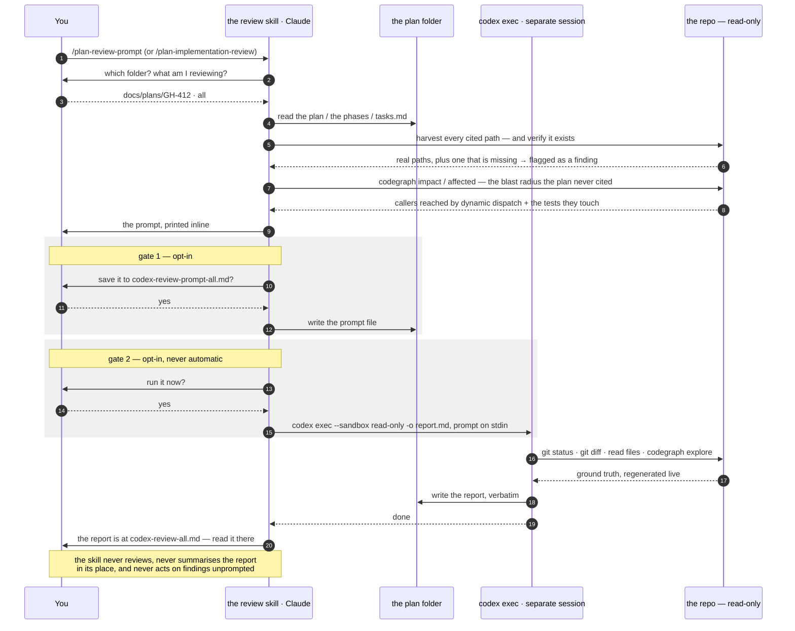

Decline either gate and you still have the prompt, which is the deliverable — any reviewer with read access to the repo will take it.

A decomposition review of GH-412 would be looking for exactly the kind of thing this plan almost got wrong: whether the `application.yml` overlap is genuinely resolved or merely noted, whether Phase 02 can really run before the API exists, and whether Phase 05's verification names commands that exist.

---

# Part 3 · Execute — in a fresh conversation

`execute-plan.md` has three parts and **only the middle one is for the machine**: a round list for you at the top, one fenced ~170-line block under `## Coordinator Prompt`, and tips for you at the bottom. Paste only the fenced block, as your very first message, with no preamble.

````bash
awk '/^## Coordinator Prompt/{f=1;next} f&&/^```/{c++;next} f&&c==1' \
  docs/plans/GH-412/execute-plan.md | clip.exe      # pbcopy on macOS, xclip -sel c on Linux
````

Then the coordinator loops. Round 1 of GH-412 looks like this:

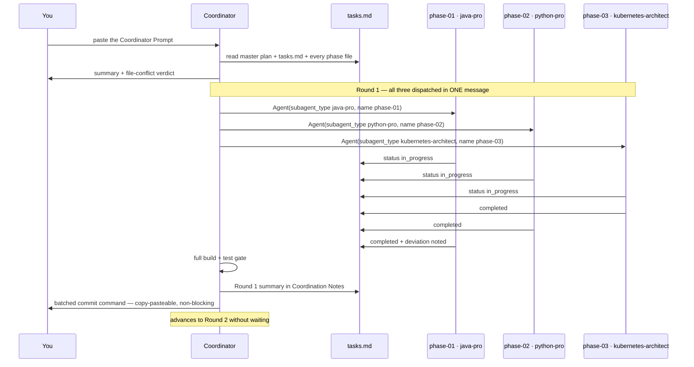

Four things about that diagram are load-bearing:

- **One message, three `Agent` calls.** Sequential dispatch forfeits the entire point of rounds. If you see the coordinator dispatching one at a time, stop it.
- **`tasks.md` is the only shared state.** The three teammates never talk to each other. Everything one needs from another was written into "Notes for downstream phases" at decomposition time.
- **Phases never commit.** Each leaves a clean, tested tree and writes `(pending batch)`. Parallel agents committing independently produce interleaved partial commits nobody can review, and per-phase approval stalls the run on every finish.
- **The commit command does not block.** The coordinator surfaces it and moves on; you run it whenever you like.

You can check in on a running teammate with `SendMessage(to="phase-01", message="summarise progress and update tasks.md")`.

### What a deviation looks like when it works

Phase 01 discovers that `RefundService` already takes an amount parameter, added by GH-388 and never used. It notes the deviation in its `tasks.md` progress section instead of silently adapting. The coordinator reads that at end-of-round and carries it into the Round 1 summary — so Phase 04, dispatched later in a different context window, is told the parameter already exists rather than adding a second one.

That is the whole mechanism: **deviations travel through the file, not through anyone's memory.**

### And when a phase blocks

Phase 02 finds that the reconciler's checkpoint format changed under it — the thing `tasks.md` flagged as *inferred, not specified*, back at decomposition. It does not guess:

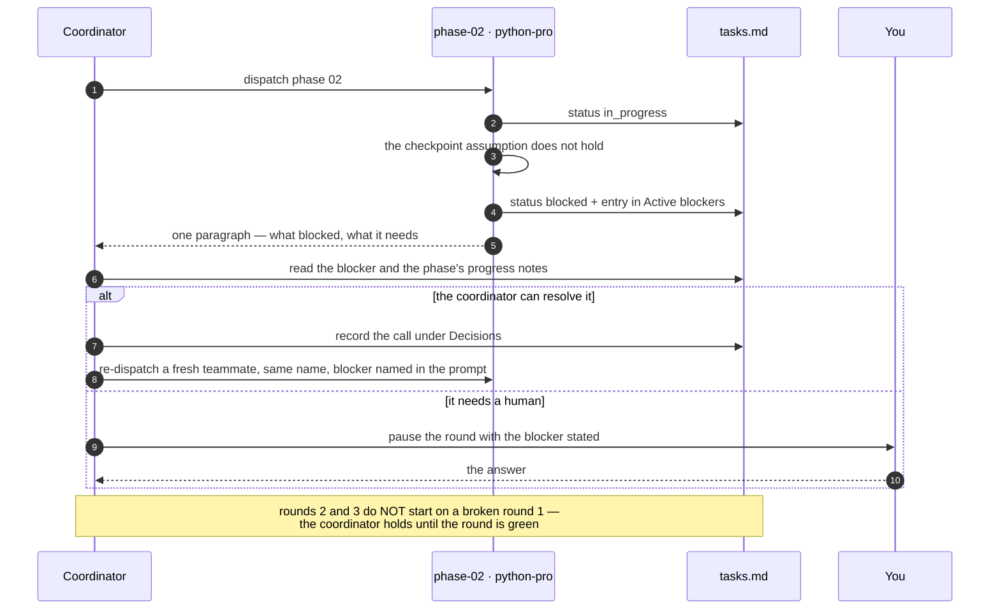

Two rules make this safe rather than chaotic: a blocked phase writes `Status = blocked` and fills **Active blockers** instead of improvising, and the coordinator records the resolution under **Decisions**. Six months later, `tasks.md` still explains why the reconciler works the way it does.

---

# Part 3.5 · Git: who commits, when, and how to say it

This is the part that reads as confusing, and the confusion is real — but it comes from **two independent mechanisms being mistaken for one**:

| Mechanism | Comes from | What it decides |
|---|---|---|
| **Commit batching** | These plugins | *When* a commit happens: never per phase, always in batches |
| **Who runs git** | Your project + your instructions | *Whether Claude runs it* or hands you the command |
| **Worktrees** | Neither of the above — `superpowers:using-git-worktrees` and the harness's own `EnterWorktree` | *Where* the work happens |

Nothing in `create-master-plan`, `decompose-plan` or `plan-review` mentions worktrees. Not once. If a worktree appears in your run, it came from `superpowers` or from the harness, never from this pack.

### The one rule the plugins do impose

**Phases never commit.** Not "prefer not to" — the generated phase templates omit the commit step entirely, and the coordinator prompt tells every teammate it is read-only for git. Each phase leaves a clean, building, fully-tested tree and writes `(pending batch)` in its `tasks.md` row. The coordinator assembles a batched commit at end-of-round.

That is not fussiness. Five agents finishing at unpredictable times and committing independently produce interleaved partial commits nobody can review — and asking you to approve one commit per phase stalls the run six times.

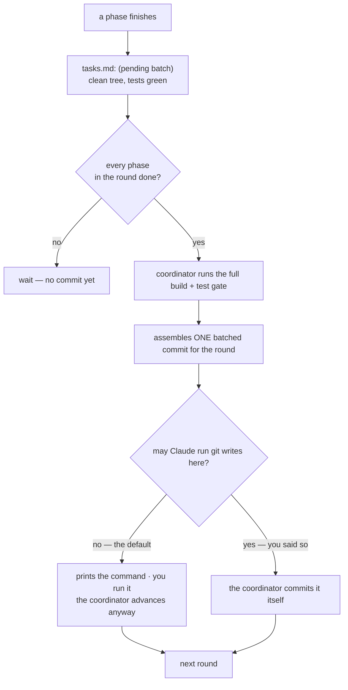

### The three postures, and the exact words

Pick one and say it **once, at the start of the run** — in the same message as the Coordinator Prompt, or in the message right after it:

| You want | Type this | What you get |
|---|---|---|
| **Show me, I commit** *(the default, and the safest)* | *"Don't run any git write commands. At the end of each round, print the batched commit as a copy-pasteable block and keep going."* | Commands as text. Nothing touches history without you. |
| **Commit for me, don't push** | *"You may run `git add` and `git commit` yourself for the end-of-round batches. Never push."* | History advances locally, round by round. `origin` is untouched. |
| **Commit and push** | *"Commit each round's batch yourself and push to `origin` on the feature branch. Never push to `main`."* | Fully autonomous. Say the branch name explicitly. |

**Push is a separate permission from commit, and you have to say so.** "You can commit" does not mean "you can push", and Claude will not assume it does. Every posture above names the push rule on purpose.

**Say the branch, too.** The harness convention is that Claude does not commit unless asked, and creates a branch first if you are on the default one. If you have a branch already, name it: *"we're on `feature/gh-412-partial-refunds`, commit there"*. Ambiguity here is what produces a surprise branch.

### Say it once, permanently

Repeating the posture every session is exactly how it drifts. Write it where every future run reads it — this file is checked by the phase templates and named in the skills:

```markdown
<!-- .claude/rules/git-workflow.md -->
# Git workflow

- Claude is READ-ONLY for git. Never run add / commit / push / rebase / reset.
- Batched commit commands are surfaced as text; the human runs them.
- Commit format: `GH-<issue>: <imperative summary>`
- Never commit directly to `main`. Feature branches only.
```

With that file present, the coordinator emits commands instead of running them and you never restate it. Without it, the coordinator asks — or infers from what you said last, which is worse. `CLAUDE.md` works too; a dedicated rules file is easier for a reviewer to find.

### How this lands as branches, commits and a PR

The workflow has an opinion about history, and it is worth following because the reviews later depend on it.

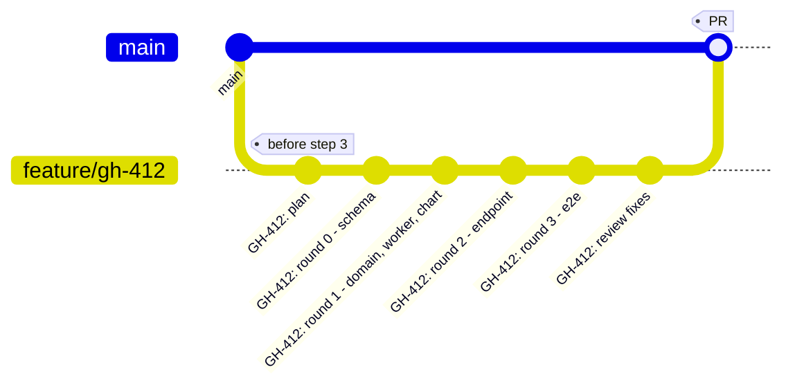

**One branch per ticket, created before step 1.** Everything — the plan folder included — lands on it. The branch name carrying the ticket id is what lets you find this six months later from a blame line.

**Commit the plan folder before you execute, on its own commit.** This is the highest-leverage habit in the whole flow, and it costs one command:

```sh
git add docs/plans/GH-412 && git commit -m "GH-412: plan"
```

Three things fall out of it. The implementation diff stops containing the plan, so it reads as code. `/plan-implementation-review` against `HEAD` sees exactly the changeset that implements the plan, not the plan plus the changeset. And if a review sends you back to sharpen the plan, that revision is its own commit and you can see what changed about the intent.

**One commit per round** is what the coordinator proposes by default, and it is the right granularity: each commit is a coherent, building, tested unit that a reviewer can read alone. Ask for a single squashed commit at the end and you get a diff nobody reviews.

| Artifact | Commit it? | Why |
|---|---|---|
| `issue.specs`, `master-plan.md` | **Yes** — in the plan commit | The reasoning behind the change. Reviewers open it before the code. |
| `phases/`, `execute-plan.md` | **Yes** — same commit | How the work was split, and the file-conflict verdict. Explains the commit shape. |
| `tasks.md` | **Yes** — it evolves across the round commits | The status board, then the record. Its Decisions section is why the reconciler works the way it does. |
| `handoff.md` | **Yes** — in the last commit | Written to be read first by the reviewer. It is the PR body. |
| `attachments/` | Usually | Unless the ticket attached something large or private. |
| `codex-*-review-prompt.md`, `codex-*-review.md` | **Your call** | Committing them makes the second opinion part of the record; `.gitignore`-ing them keeps the folder clean. Pick one and be consistent — a half-committed review folder confuses the next reader. |

**The PR opens after the last round, not before.** `handoff.md` is written to be its body: what shipped, reading order, files touched, **deviations from the plan**, TODOs, how to verify, review focus. Paste it in, and put the PR URL in `tasks.md`'s `PR` column so the board and the PR point at each other.

Then the two reviews attach to it differently, and the difference matters:

| | Where it runs | How it reaches the PR |
|---|---|---|
| `/code-review --comment` | In Claude Code, on the branch diff | Posts its findings as inline PR comments itself |
| `/plan-implementation-review` | Generates a prompt; Codex runs it in its own session | Produces a report file. You paste it as a PR comment, or fix first and never post it |

One detail that trips people on the review side: **once the work is committed on a branch, the diff base is no longer `HEAD`.** Answer `master` — or whatever you branched from — when the skill asks. Against `HEAD` on a committed branch the tree is clean, and the skill will correctly stop and tell you the review would be vacuous.

### Worktrees — what they are actually for here

A worktree is a second checkout of the same repository on its own branch, in its own directory. In this workflow the useful granularity is **one worktree per ticket, never one per phase.**

**Not per phase, and this is the part worth internalising.** All six teammates work in the *same* tree. That is by design — it is precisely why the file-conflict matrix exists. Give each phase its own worktree and you have not removed the conflict, you have converted it into six merges nobody planned.

So a worktree buys you one thing: **GH-412 does not touch your main checkout.** You keep working on something else while the run proceeds, and if the whole thing goes wrong you delete a directory.

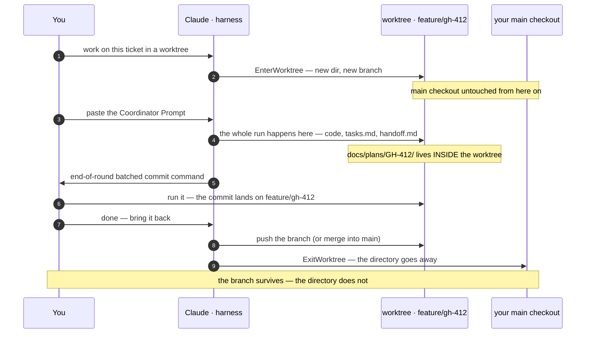

**How to ask for one:** *"Set up a worktree for GH-412 before we start"* — or state the preference up front and skip the consent question: *"Always use a worktree for ticket work."* The skill honours a preference you have already declared and only asks when you have not.

Three things that bite people, in the order they bite:

- **The plan folder moves.** `docs/plans/GH-412/` lives inside the worktree. Every path you type — for `/decompose-plan`, for the review skills — is relative to *that* directory. A review run from your main checkout will read a `tasks.md` that has not moved since decomposition.
- **The directory is disposable; the branch is not.** `ExitWorktree` removes the directory. If the work is not committed and the branch not pushed, it is gone. Commit before you exit.
- **Finishing is a separate decision.** A worktree does not merge itself. Say what you want: *"merge `feature/gh-412` into `main` and delete the worktree"*, or *"push the branch and open a PR, leave `main` alone"*. `superpowers:finishing-a-development-branch` exists for exactly this and will ask if you do not say.

### The whole thing in four lines

If you want one message that removes every ambiguity above, this is it — paste it right after the Coordinator Prompt:

```text
Work in a worktree on branch feature/gh-412-partial-refunds.
Do not run any git write commands: print each end-of-round batched
commit as a copy-pasteable block and continue without waiting for me.
When the last round is done, stop — I decide about merging and pushing.
```

Every clause maps to one of the three mechanisms: where the work happens, who runs git, and when commits are grouped.

---

# Part 4 · Review what actually landed

Two reviews, answering different questions. Neither replaces the other.

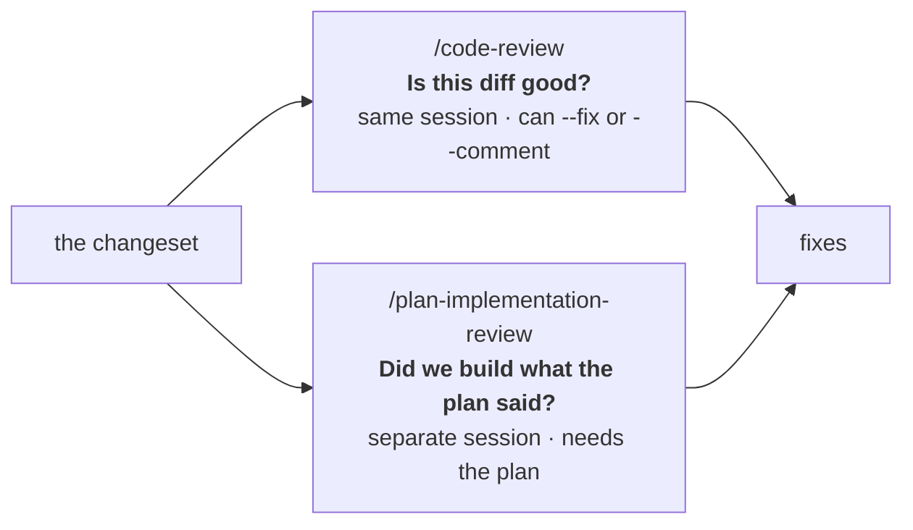

`/code-review` judges the diff on its own merits and can apply findings with `--fix` or post them with `--comment`. It cannot judge plan conformance, because judging that requires the plan.

```
/plan-implementation-review
```

It asks for the planning folder and what the diff is measured against — `HEAD` for pending changes, or `master` when your agents cannot commit and the work is already on a branch. **If the working tree is clean it stops and asks** rather than emitting a prompt over an empty diff.

Then it builds a prompt from two sources of truth at once: the plan (what was *promised*) and the changeset (what *landed*), plus the exact commands to reproduce the diff live, the untracked files listed separately because they carry no diff, a changed-file → plan-item map that is **navigational and never evaluative**, and your repository's own standards discovered rather than assumed. On an indexed repo the blast-radius half of that reading list comes from `codegraph impact` and the test list from `codegraph affected`, rather than being inferred from the hunks — a diff shows what changed, never who depended on it. Run it the same way:

```sh
codex exec --sandbox read-only ${CODEX_MODEL:+-m "$CODEX_MODEL"} \
  -o docs/plans/GH-412/codex-implementation-review.md \
  < docs/plans/GH-412/codex-implementation-review-prompt.md
```

Leave the tree alone while it runs — the reviewer regenerates the diff live, so edits mid-run produce findings against code that no longer exists.

### What it catches that a diff review cannot

| Failure | Why `/code-review` misses it |
|---|---|
| Phase 02 implemented half of what its phase file specified and marked itself complete | The code that *is* there is clean and tested |
| Phase 03 solved the flag differently — hardcoded in the chart instead of templated | It reads as a deliberate, tidy choice |
| The `application.yml` coordination rule was violated: both phases edited it, last write won | The diff shows one coherent file |
| A phase was skipped and nobody noticed | There is no diff to look at |

The status-honesty check is the one worth the run on its own: the reviewer compares what `tasks.md` *claims* is complete against what the code shows. In a run where six agents each report their own status, that is the only independent check that exists.

### Read the findings like findings

**They are claims, not verdicts.** Some are wrong. Verify each against the code before changing anything — accepting a wrong finding costs more than missing a marginal one. The generated prompt is what makes them checkable: it forces `file:line` citations, separates conformance facts from quality findings from preferences, and requires "I couldn't verify X" instead of an assumption.

---

# Part 5 · Close out

After the last round:

1. **Real commit SHAs and the final summary in `tasks.md`** — replace every `(pending batch)`.
2. **Every section of `handoff.md` filled**, especially **deviations from the plan**. That is where reviewers spend their attention and where unexamined assumptions hide.
3. **Anything durable folded into `.claude/rules/`** rather than left in a plan folder nobody reopens. If this run taught you that the team wants domain errors instead of exceptions, that belongs in a rule file, not in `docs/plans/GH-412/`.

```markdown
## Deviations from the plan

- Phase 01: `RefundService` already accepted an amount parameter, added unused by
  GH-388. Reused it instead of adding a second. Phase 04 was told at end-of-round.
- Phase 03: the flag is templated into the ConfigMap as planned, but the Helm value
  is named `partialRefunds.enabled`, not `payments.partial-refunds.enabled` — Helm
  values are camelCase by chart convention. The Java property name is unchanged.
- Phase 05: `helm template` smoke test added to CI, which the plan did not ask for.
  Cheap, and it would have caught the naming mismatch above.
```

---

## Command cheat sheet

````sh
# once per machine
/plugin marketplace add necofx/necofx-claude-marketplace
/plugin install create-master-plan@necofx
/plugin install decompose-plan@necofx
/plugin install plan-review@necofx
/plugin marketplace add anthropics/claude-plugins-official
/plugin install superpowers@claude-plugins-official
/plugin marketplace add wshobson/agents
/plugin install jvm-languages@claude-code-workflows      # + the bundles your stack needs
codegraph init                                            # optional, in the repo root

# per ticket
git switch -c feature/gh-412-partial-refunds              # one branch per ticket, before step 1
/create-master-plan 412                                   # → issue.specs, master-plan.md
/decompose-plan docs/plans/GH-412                         # → phases/, tasks.md, execute-plan.md
/plan-review-prompt                                       # optional — review the plan first
git add docs/plans/GH-412 && git commit -m "GH-412: plan" # commit the plan BEFORE executing
awk '/^## Coordinator Prompt/{f=1;next} f&&/^```/{c++;next} f&&c==1' \
  docs/plans/GH-412/execute-plan.md                       # paste into a FRESH conversation
/code-review                                              # the diff on its own merits
/plan-implementation-review                               # optional — the diff against the plan

# updates
/plugin marketplace update necofx
/plugin update plan-review@necofx
````

## The five checkpoints, in one place

| After | Check | If it is wrong |
|---|---|---|
| step 1 | The outline is at chunk level; validation gates name your real commands | Fix the plan now — it is the cheapest place |
| step 2 | The phases are ones you would have written; read every `## Coordination Notes` flag | Sharpen the plan, not the phases |
| step 2.5 | The external reviewer's findings on the plan | Fold them back into the plan before executing |
| step 3 | The coordinator dispatched a round in **one** message | Stop it — sequential dispatch wastes the whole design |
| step 3 | You stated the git posture **before** the first round, not after it | See [Part 3.5](#part-35--git-who-commits-when-and-how-to-say-it) — a posture declared mid-run leaves the earlier rounds inconsistent |
| step 4/5 | Deviations are recorded, not absorbed | An unrecorded deviation is the one that bites in production |

## When it goes wrong

Each plugin's README carries its own troubleshooting table. The three failures that come from *joining* the steps rather than from any one of them:

| Symptom | Cause and fix |
|---|---|
| The coordinator loses track mid-run, or repeats a round | Step 3 was not started in a fresh conversation. Restart it in an empty one — `tasks.md` holds the state, so nothing is lost. |
| A commit appeared you did not ask for, or none appeared at all | The git posture was never stated. Declare it once in `.claude/rules/git-workflow.md` rather than per session — [Part 3.5](#part-35--git-who-commits-when-and-how-to-say-it). |
| A review reads a `tasks.md` that is out of date | You are running it from the main checkout while the work lives in a worktree. Every path is relative to the worktree. |
| Two phases in one round hit the same file anyway | The matrix caught it and the coordination rule was ignored, or it missed the file because the master plan never named it. Move one phase to the next round. |
| Agents ignore your conventions | Check a phase's "Documents to Read" — an empty list means there was nothing to cite. Writing `.claude/rules/*.md` is the highest-leverage thing you can do here, and nobody can ship it for you. |
